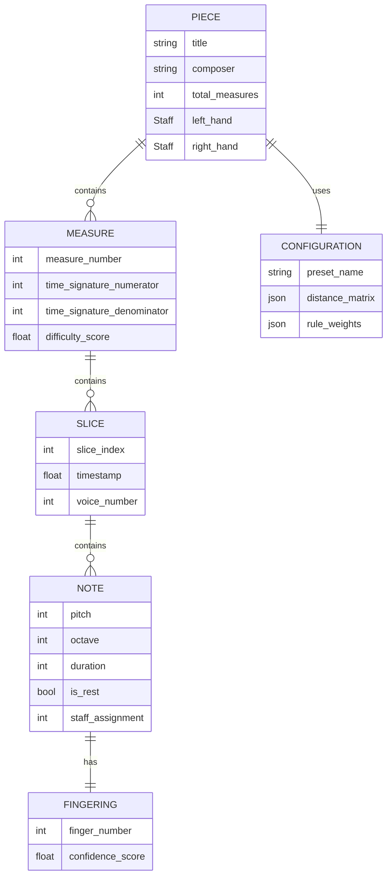

# Software Requirements Specification (SRS)

## Piano Fingering Generator

# 1. Introduction

## 1.1 Purpose

This Software Requirements Specification (SRS) defines the functional and nonfunctional requirements for the **Piano Fingering Generator**, a command-line utility that automatically generates optimal finger assignments for piano sheet music. The intended audience includes:

- **Software Developers:** Responsible for implementing the system
- **Quality Assurance Engineers:** Responsible for validating the system against these requirements
- **Project Stakeholders:** Piano educators and students who will use the system

## 1.2 Scope

The Piano Fingering Generator is a standalone C++ application that accepts MusicXML files as input and produces fingered MusicXML files as output. The system implements a hybrid Beam Search Dynamic Programming and Iterated Local Search algorithm to solve the NP-hard piano fingering optimization problem.

**Benefits:**
- Automates the time-consuming task of determining optimal fingerings
- Provides pedagogical support for piano students learning new repertoire
- Enables consistent, biomechanically sound fingering suggestions

**Objectives:**
- Process standard piano repertoire (500-2000 notes) in under 5 seconds
- Preserve all non-fingering musical information from the input
- Support user customization for different hand sizes
- Provide cross-platform compatibility (Windows, macOS, Linux)

**Out of Scope:**
- Graphical user interface (GUI)
- Real-time MIDI fingering suggestion
- Automatic hand assignment (left/right distribution)
- Cross-hand collision detection
- Direct integration with notation software (MuseScore, Finale, Sibelius)

## 1.3 Definitions, Acronyms, and Abbreviations

| Term | Definition |
|------|------------|
| **Beam Search** | A heuristic search algorithm that explores a limited number of most promising states at each step |
| **DP** | Dynamic Programming - an algorithmic technique that solves complex problems by breaking them down into simpler subproblems |
| **ERD** | Entity-Relationship Diagram |
| **Grand Staff** | The standard two-staff musical notation system for piano (treble and bass clefs) |
| **ILS** | Iterated Local Search - a metaheuristic that iteratively applies local search and perturbation |
| **MTBF** | Mean Time Between Failures |
| **MusicXML** | An XML-based file format for representing Western musical notation |
| **NP-hard** | Nondeterministic Polynomial-time hard - a class of computationally complex problems |
| **PCSP** | Partial Constraint Satisfaction Problem |
| **Slice** | A vertical time segment containing all simultaneously played notes |
| **SRS** | Software Requirements Specification |

## 1.4 References

1. Parncutt, R., et al. (1997). "An ergonomic model of keyboard fingering for melodic fragments." *Music Perception*, 14(4), 341-382.
2. Koster, A.M., et al. (1998). "The partial constraint satisfaction problem: Facets and lifting theorems." *Operations Research Letters*, 23(3-5), 89-97.
3. MusicXML 3.1 Specification: https://www.w3.org/2021/06/musicxml40/
4. Wiegers, K. & Beatty, J. (2013). *Software Requirements, 3rd Edition*. Microsoft Press.
5. IEEE Std 830-1998: IEEE Recommended Practice for Software Requirements Specifications

## 1.5 Document Overview

This SRS is organized as follows:

- **Section 2:** Overall system description, user classes, operating environment, and constraints
- **Section 3:** Detailed functional requirements organized by system features
- **Section 4:** Data requirements including logical models and data dictionary
- **Section 5:** External interface requirements (user, hardware, software, communications)
- **Section 6:** Nonfunctional requirements (performance, security, quality attributes)
- **Appendix A:** Algorithmic parameters and rule definitions

---

# 2. Overall Description

## 2.1 Product Perspective

The Piano Fingering Generator is a **new, self-contained product** designed to fill a gap in music pedagogy tools. While notation software (MuseScore, Finale, Sibelius) provides manual fingering annotation, no widely available tool automatically generates biomechanically optimized fingerings based on ergonomic research.

**System Context Diagram:**

```
┌─────────────────┐
│  MusicXML File  │
│   (Input)       │
└────────┬────────┘
         │
         ▼
┌──────────────────────────────────────┐
│  Piano Fingering Generator (C++)    │
│  ┌────────────────────────────────┐ │
│  │ XML Parser                     │ │
│  └────────────────────────────────┘ │
│  ┌────────────────────────────────┐ │
│  │ Beam Search DP Engine          │ │
│  └────────────────────────────────┘ │
│  ┌────────────────────────────────┐ │
│  │ ILS Optimizer                  │ │
│  └────────────────────────────────┘ │
│  ┌────────────────────────────────┐ │
│  │ Configuration Manager          │ │
│  └────────────────────────────────┘ │
│  ┌────────────────────────────────┐ │
│  │ MusicXML Generator             │ │
│  └────────────────────────────────┘ │
└──────────────┬───────────────────────┘
               │
               ▼
      ┌────────────────┐
      │  MusicXML File │
      │  (Fingered)    │
      └────────────────┘
```

The system operates as a **filter-style command-line utility**, consuming MusicXML on input and producing enhanced MusicXML on output without external service dependencies.

## 2.2 User Classes and Characteristics

### 2.2.1 Primary User Class: Piano Students

**Frequency of Use:** Weekly to daily  
**Subset of Functions:** Core fingering generation with default settings  
**Technical Expertise:** Low to moderate (comfortable with command-line basics)  
**Security/Privilege Level:** Standard user  

**Characteristics:**
- Learning repertoire ranging from beginner exercises to intermediate classical pieces
- Need quick, reliable fingering suggestions to accelerate learning
- May not understand algorithmic parameters but benefit from preset configurations

**Typical Use Case:** Generate fingering for a newly downloaded Bach Invention to begin practice.

### 2.2.2 Secondary User Class: Piano Educators

**Frequency of Use:** Daily  
**Subset of Functions:** Core generation + custom configuration for different student hand sizes  
**Technical Expertise:** Moderate (willing to maintain configuration files)  
**Security/Privilege Level:** Standard user  

**Characteristics:**
- Prepare teaching materials for students with varying hand sizes
- May batch-process multiple pieces for curriculum planning
- Value deterministic results (same input → same output) for consistent teaching

**Typical Use Case:** Batch-generate fingerings for 10 Hanon exercises using "Small" hand preset for a young student.

### 2.2.3 Tertiary User Class: Researchers

**Frequency of Use:** Occasional  
**Subset of Functions:** Full algorithmic control (mode selection, seed specification, verbose logging)  
**Technical Expertise:** High (computer science or music informatics background)  
**Security/Privilege Level:** Standard user  

**Characteristics:**
- Study fingering algorithms or biomechanical optimization
- Require reproducible results for scientific publication
- Need detailed diagnostic output to analyze algorithm behavior

**Typical Use Case:** Run comparative analysis of "Fast" vs. "Quality" modes on 100-piece corpus with controlled random seeds.

## 2.3 Operating Environment

### 2.3.1 Hardware Platform

- **Processor:** x86-64 architecture (Intel/AMD) or ARM64 (Apple Silicon)
- **Minimum Cores:** 2 physical cores
- **Recommended Cores:** 4-8 cores for optimal parallel performance
- **Memory:** Minimum 1GB available RAM
- **Storage:** 50MB for application binary + working space for MusicXML files

### 2.3.2 Software Platform

| Platform | Minimum Version | Notes |
|----------|----------------|-------|
| **Windows** | Windows 10 (Build 19041) | 64-bit only |
| **macOS** | macOS Monterey 12.0 | Universal Binary (x86_64 + ARM64) |
| **Linux** | Ubuntu 22.04 LTS or equivalent | glibc 2.35+ |

**Runtime Dependencies:** None (statically linked binary)

### 2.3.3 Coexistence Requirements

The system must peacefully coexist with:
- **Notation Software:** MuseScore 4.x, Finale 27.x, Sibelius 2023.x (output must be importable)
- **File System:** Must respect file locks and handle read-only input files gracefully
- **Shell Environment:** Must return proper exit codes for shell script integration

## 2.4 Design and Implementation Constraints

### 2.4.1 Regulatory Policies

- **Open Source Licensing:** If distributed publicly, must comply with licenses of embedded libraries (TinyXML-2: zlib license)
- **Export Control:** No restrictions (music education tool)

### 2.4.2 Hardware Limitations

- **Memory Budget:** Must not exceed 512MB RAM for a 2000-note piece
- **CPU Affinity:** Must utilize available CPU cores without requiring kernel-level privileges

### 2.4.3 Interface Requirements

- **Standard Input/Output:** Must use POSIX-compliant stdin/stdout/stderr conventions
- **File Format Compatibility:** Must parse and generate MusicXML 3.0 or later

### 2.4.4 Technology Mandates

| Constraint | Requirement | Rationale |
|------------|-------------|-----------|
| **Programming Language** | C++20 | Performance requirements + modern standard library features |
| **Build System** | CMake 3.20+ | Cross-platform build portability |
| **XML Library** | TinyXML-2 or equivalent header-only library | Minimize external dependencies |
| **Threading** | C++11 `<thread>` standard library | Avoid platform-specific APIs (pthreads, WinAPI) |
| **Static Linking** | Required for release binaries | Single-file distribution simplicity |

### 2.4.5 Development Standards

- **Code Style:** Follow [Google C++ Style Guide](https://google.github.io/styleguide/cppguide.html)
- **Version Control:** Git with semantic versioning (MAJOR.MINOR.PATCH)
- **Testing Framework:** Google Test for unit and integration tests

---

# 3. System Features

This section organizes functional requirements by **system feature** (major service provided to the user). Each feature includes a description, priority, and specific "shall" statements.

## 3.1 Feature: MusicXML Parsing and Validation

**Description:** The system ingests MusicXML files, extracts note/chord/rest information, and validates the structure is processable.

**Priority:** Critical (no processing possible without successful parsing)

**Stimulus/Response Sequences:**
1. User invokes the program with a MusicXML file path
2. System reads the file from the filesystem
3. System parses the XML structure
4. System validates the presence of required musical elements
5. System proceeds to fingering generation or terminates with an error

**Functional Requirements:**

**FR-1.1:** The System shall accept a single MusicXML file as the first positional command-line argument.

**FR-1.2:** The System shall parse MusicXML files conforming to version 3.0 or later of the MusicXML specification.

**FR-1.3:** The System shall extract the following elements from the MusicXML structure:
- Note elements (pitch, duration, voice assignment)
- Chord elements (simultaneous note groupings)
- Rest elements (timing information)
- Staff assignments (staff="1" and staff="2")
- Measure boundaries

**FR-1.4:** The System shall preserve all non-fingering XML elements present in the input file during processing.

**FR-1.5:** If the MusicXML file cannot be opened due to filesystem errors, the System shall terminate with exit code 2 and print an error message to stderr in the format: `Error: Cannot open input file '<path>': <reason>`.

**FR-1.6:** If the XML structure is malformed such that note elements cannot be identified, the System shall terminate with exit code 3 and print an error message to stderr in the format: `Error: Invalid MusicXML at line <N>: <parser_message>`.

**FR-1.7:** If the MusicXML file does not contain staff assignments for notes, the System shall assume the following default mapping:
- Notes in the first `<part>` or with `staff="1"` → Right Hand
- Notes in the second `<part>` or with `staff="2"` → Left Hand

**FR-1.8:** If the System applies the default hand assignment rule (FR-1.7), it shall print a warning to stderr: `Warning: Assuming Staff 1 is Right Hand.`

**FR-1.9:** The System shall support MusicXML files with the following musical complexity limits:
- Up to 5 simultaneous notes per staff (chord size M ≤ 5)
- Exactly 2 staves (Grand Staff notation)

**FR-1.10:** If the input file exceeds the limits defined in FR-1.9, the System shall print a warning to stderr but shall not terminate processing.

## 3.2 Feature: Configuration Management

**Description:** The system loads user-specific biomechanical parameters (distance matrices, rule weights) from predefined presets or custom JSON files.

**Priority:** High (required for hand-size customization)

**Functional Requirements:**

**FR-2.1:** The System shall ship with three embedded configuration presets: `Small`, `Medium`, and `Large`.

**FR-2.2:** Each preset shall define a complete distance matrix as specified in Table 1 of the Problem Description (MinPrac, MinComf, MinRel, MaxRel, MaxComf, MaxPrac for all 10 finger pairs).

**FR-2.3:** Each preset shall define penalty weights for all 15 rules as specified in Table 2 of the Problem Description.

**FR-2.4:** If no configuration is specified by the user, the System shall default to the `Medium` preset.

**FR-2.5:** The System shall accept a `--preset=<name>` command-line flag where `<name>` is one of: `Small`, `Medium`, `Large`.

**FR-2.6:** The System shall accept a `--config=<path>` command-line flag where `<path>` is a filesystem path to a JSON configuration file.

**FR-2.7:** If both `--preset` and `--config` are specified, the System shall apply configurations in the following precedence order (highest to lowest):
1. Custom JSON file values
2. Preset values
3. Default (Medium) values

**FR-2.8:** The custom JSON file shall support partial configuration (overlay semantics) such that only specified fields override the base preset.

**FR-2.9:** The System shall validate the custom configuration file against the following logical constraints:
- For each finger pair: `MinPrac < MinComf < MinRel < MaxRel < MaxComf < MaxPrac`
- All penalty weights must be non-negative real numbers

**FR-2.10:** If a custom configuration file violates the constraints in FR-2.9, the System shall terminate with exit code 4 and print an error message to stderr in the format: `Configuration Error: <specific_violation>`.

**FR-2.11:** If a custom configuration file contains unrecognized fields, the System shall ignore those fields and print a warning to stderr.

**FR-2.12:** If a custom configuration file is missing required JSON structure (e.g., not valid JSON), the System shall terminate with exit code 4 and print an error message to stderr.

## 3.3 Feature: Fingering Optimization (Core Algorithm)

**Description:** The system applies the hybrid Beam Search DP + ILS algorithm to compute optimal finger assignments for each hand independently.

**Priority:** Critical (core value proposition)

**Functional Requirements:**

**FR-3.1:** The System shall treat the left hand and right hand as independent optimization sub-problems.

**FR-3.2:** For each hand, the System shall assign a finger value from the set {1, 2, 3, 4, 5} to each note.

**FR-3.3:** The System shall enforce the hard constraint that no two notes played simultaneously (within the same chord/slice) may share the same finger assignment.

**FR-3.4:** If a candidate solution violates the constraint in FR-3.3, the System shall reject that candidate during the optimization process.

**FR-3.5:** The System shall compute the total difficulty score (Z) for a fingering solution as the sum of:
- Inter-slice transition costs (Rules 1, 2, 5-13, 15)
- Intra-slice chord costs (Rule 14)
- Triplet costs (Rules 3, 4, 12)

**FR-3.6:** The System shall apply the 15 fingering rules as defined in Table 2 of the Problem Description with penalties configured per Section 3.2.

**FR-3.7:** The System shall support three optimization modes selectable via the `--mode=<mode>` flag:
- `fast`: Greedy constructive heuristic only (no ILS)
- `balanced`: Beam Search DP + 1000 ILS iterations (default)
- `quality`: Beam Search DP + 5000 ILS iterations

**FR-3.8:** If the `--mode` flag is not specified, the System shall default to `balanced` mode.

**FR-3.9:** The System shall execute the Beam Search DP phase with a beam width of 100 states per slice.

**FR-3.10:** The System shall utilize CPU multi-threading to parallelize:
- Left hand and right hand optimization (2-way parallelism)
- Multiple ILS trajectories (N-way parallelism where N = number of available CPU cores)

**FR-3.11:** The System shall accept a `--seed=<integer>` flag to initialize the random number generator for reproducible results.

**FR-3.12:** If the `--seed` flag is not specified, the System shall generate a random seed using the system clock.

**FR-3.13:** The System shall print the active random seed to stdout in the format: `Running with Seed: <value>`.

**FR-3.14:** The System shall always produce a valid fingering solution even if the difficulty score exceeds standard playability thresholds.

## 3.4 Feature: MusicXML Output Generation

**Description:** The system writes the computed fingering assignments back to MusicXML format, preserving all original musical information.

**Priority:** Critical (required for deliverable output)

**Functional Requirements:**

**FR-4.1:** The System shall generate a MusicXML file containing all elements from the input file plus computed fingering annotations.

**FR-4.2:** The System shall add fingering information using the `<fingering>` element as defined in the MusicXML 3.1 specification.

**FR-4.3:** The `<fingering>` element shall be inserted as a child of the `<technical>` element within each `<note>`.

**FR-4.4:** The System shall preserve all original XML elements from the input file including:
- Dynamics markings
- Articulation markings
- Lyrics
- Metadata (title, composer, copyright)
- Measure numbers
- Time signatures
- Key signatures

**FR-4.5:** The System shall accept an optional second positional argument specifying the output file path.

**FR-4.6:** If no output path is specified, the System shall generate an output filename by appending `_fingered` before the file extension of the input filename.

**FR-4.7:** Example of default output naming: `beethoven_op27.musicxml` → `beethoven_op27_fingered.musicxml`.

**FR-4.8:** If the output file already exists, the System shall terminate with exit code 5 and print an error message to stderr: `Error: Output file '<path>' already exists. Use --force to overwrite.`

**FR-4.9:** If the `--force` (or `-f`) flag is present, the System shall overwrite the existing output file without warning.

**FR-4.10:** The System shall write the output MusicXML file with UTF-8 encoding.

**FR-4.11:** The System shall generate valid XML conforming to the MusicXML 3.1 schema.

**FR-4.12:** If the System cannot write to the output file due to filesystem errors (permissions, disk space), it shall terminate with exit code 6 and print an error message to stderr: `Error: Cannot write output file '<path>': <reason>`.

## 3.5 Feature: Command-Line Interface

**Description:** The system provides a standard POSIX-compliant CLI for user interaction and scriptability.

**Priority:** High (primary interaction mechanism)

**Functional Requirements:**

**FR-5.1:** The System shall support the following command-line syntax:
```
piano-fingering [OPTIONS] <input_file> [output_file]
```

**FR-5.2:** The System shall support the following command-line flags:

| Flag | Short | Type | Default | Description |
|------|-------|------|---------|-------------|
| `--help` | `-h` | Boolean | N/A | Display usage information |
| `--version` | `-v` | Boolean | N/A | Display version information |
| `--mode` | `-m` | String | `balanced` | Optimization mode |
| `--preset` | `-p` | String | `Medium` | Hand size preset |
| `--config` | `-c` | String | None | Custom config file path |
| `--seed` | `-s` | Integer | Random | RNG seed for reproducibility |
| `--force` | `-f` | Boolean | False | Overwrite existing output |
| `--verbose` | None | Boolean | False | Enable detailed logging |
| `--quiet` | `-q` | Boolean | False | Suppress non-error output |

**FR-5.3:** If the `--help` flag is present, the System shall print usage instructions to stdout and terminate with exit code 0.

**FR-5.4:** The usage instructions shall include:
- Synopsis of command syntax
- Description of all flags with examples
- Example invocations for common scenarios

**FR-5.5:** If the `--version` flag is present, the System shall print version information to stdout and terminate with exit code 0.

**FR-5.6:** The version information shall include:
- Semantic version number (MAJOR.MINOR.PATCH)
- Build type (release/debug)
- Git commit hash (first 7 characters)

**FR-5.7:** Version output format shall be: `Piano Fingering Generator v<version>+<commit>`.

**FR-5.8:** If mutually exclusive flags are specified (e.g., `--verbose` and `--quiet`), the System shall terminate with exit code 1 and print an error message to stderr.

**FR-5.9:** If an unrecognized flag is encountered, the System shall terminate with exit code 1 and print an error message suggesting `--help`.

**FR-5.10:** The System shall return the following exit codes:

| Code | Meaning |
|------|---------|
| 0 | Success |
| 1 | Invalid command-line arguments |
| 2 | Input file I/O error |
| 3 | XML parsing error |
| 4 | Configuration error |
| 5 | Output file exists (no --force) |
| 6 | Output file I/O error |
| 7 | Internal algorithm error |

## 3.6 Feature: Progress Reporting and Diagnostics

**Description:** The system provides feedback to the user during processing and generates diagnostic output upon completion.

**Priority:** Medium (enhances usability)

**Functional Requirements:**

**FR-6.1:** Unless the `--quiet` flag is active, the System shall print progress updates to stderr during processing.

**FR-6.2:** Progress updates shall follow the format: `Processing Measure [X] / [Total]...` where X increments as processing proceeds.

**FR-6.3:** The System shall print progress updates at intervals not exceeding 1 second of wall-clock time.

**FR-6.4:** Upon successful completion, the System shall print a summary report to stdout containing:
- Total Difficulty Score (Z value)
- Random seed used (if not specified by user)

**FR-6.5:** The summary report format shall be:
```
=== Fingering Generation Complete ===
Input: <input_filename>
Output: <output_filename>
Seed: <seed_value>
Mode: <mode_name>
Total Difficulty Score: <Z_value>
```

**FR-6.6:** If the `--verbose` flag is active, the System shall print detailed logging to stderr including:
- Rule-by-rule penalty breakdown for each measure
- Beam search pruning statistics
- ILS iteration progress

**FR-6.7:** If the `--quiet` flag is active, the System shall suppress all stdout and stderr output except for critical errors (exit codes 2-7).

**FR-6.8:** If both `--verbose` and `--quiet` are specified, the `--quiet` flag shall take precedence.

**FR-6.9:** All error messages printed to stderr shall include:
- A clear description of the error condition
- The specific value or context that caused the error
- Suggested remediation when applicable

**FR-6.10:** Error messages shall not include internal implementation details (e.g., C++ exception stack traces) unless in debug build mode.

---

# 4. Data Requirements

## 4.1 Logical Data Model

The system operates on three primary data structures:



### 4.1.1 Entity Relationships

- A **PIECE** contains one or more **MEASURE**s
- A **MEASURE** contains one or more **SLICE**s (vertical time segments)
- A **SLICE** contains one or more **NOTE**s (up to 5 per hand)
- Each **NOTE** has exactly one **FINGERING** assignment
- A **PIECE** uses exactly one **CONFIGURATION**

### 4.1.2 Cardinality Constraints

- `PIECE : MEASURE` → 1:N (minimum 1 measure per piece)
- `MEASURE : SLICE` → 1:N (minimum 1 slice per measure)
- `SLICE : NOTE` → 1:N (maximum 5 notes per slice per hand)
- `NOTE : FINGERING` → 1:1 (bijection)

## 4.2 Data Dictionary

### 4.2.1 Note Data Structure

| Field Name | Data Type | Length | Format | Allowed Values | Description |
|------------|-----------|--------|--------|----------------|-------------|
| `pitch` | Integer | 16-bit | N/A | 0-14 | Modified keyboard distance (0-14 per octave, including imaginary black keys) |
| `octave` | Integer | 8-bit | N/A | 0-10 | MIDI octave number |
| `duration` | Integer | 16-bit | N/A | 1-256 | Duration in ticks (resolution-dependent) |
| `is_rest` | Boolean | 1-bit | N/A | true/false | Indicates if this is a rest vs. sounding note |
| `staff_assignment` | Integer | 8-bit | N/A | 1-2 | Staff number (1=Right Hand, 2=Left Hand) |
| `voice` | Integer | 8-bit | N/A | 1-4 | Voice number for polyphonic passages |

### 4.2.2 Fingering Assignment

| Field Name | Data Type | Length | Format | Allowed Values | Description |
|------------|-----------|--------|--------|----------------|-------------|
| `finger_number` | Integer | 8-bit | N/A | 1-5 | Finger assignment (1=Thumb, 5=Pinky) |
| `hand` | Enumeration | N/A | N/A | LEFT, RIGHT | Which hand this fingering applies to |

### 4.2.3 Configuration Data Structure

| Field Name | Data Type | Format | Allowed Values | Description |
|------------|-----------|--------|----------------|-------------|
| `preset_name` | String | UTF-8 | "Small", "Medium", "Large" | Name of the active preset |
| `distance_matrix` | JSON Object | Nested structure | See Section 4.2.4 | Biomechanical distance constraints |
| `rule_weights` | JSON Array | Array of 15 floats | Non-negative reals | Penalty weights for each rule |

### 4.2.4 Distance Matrix JSON Schema

```json
{
  "finger_pairs": {
    "1-2": {
      "MinPrac": -8,
      "MinComf": -6,
      "MinRel": 1,
      "MaxRel": 5,
      "MaxComf": 8,
      "MaxPrac": 10
    },
    "1-3": { /* ... */ },
    /* ... 10 finger pairs total ... */
  }
}
```

**Constraints:**
- All values are integers in the range [-20, 20]
- For each finger pair: `MinPrac < MinComf < MinRel < MaxRel < MaxComf < MaxPrac`

### 4.2.5 Rule Weights JSON Schema

```json
{
  "rule_weights": [
    2.0,   // Rule 1: Below MinComf or above MaxComf
    1.0,   // Rule 2: Below MinRel or above MaxRel
    1.0,   // Rule 3: Hand position change (triplet)
    /* ... */
    1.0    // Rule 15: Same pitch, different finger
  ]
}
```

**Constraints:**
- Array must contain exactly 15 elements
- All values must be non-negative floating-point numbers

## 4.3 Data Retention and Lifecycle

**FR-7.1:** The System shall not persist any data between invocations beyond the generated output MusicXML file.

**FR-7.2:** All internal data structures (parsed notes, optimization state) shall be deallocated upon program termination.

**FR-7.3:** The System shall not create temporary files in the filesystem.

**FR-7.4:** The System shall not write configuration changes back to JSON files (configurations are read-only at runtime).

---

# 5. External Interface Requirements

## 5.1 User Interfaces

### 5.1.1 Command-Line Interface

**UI-1.1:** The System shall provide a text-based command-line interface conforming to POSIX conventions.

**UI-1.2:** The System shall display help text formatted with a maximum line width of 80 characters for terminal readability.

**UI-1.3:** Help text shall use standard formatting conventions:
- Synopsis in the form: `USAGE: <program> [OPTIONS] <args>`
- Options listed alphabetically with aligned descriptions
- Examples section demonstrating common use cases

**UI-1.4:** The System shall colorize error messages (red text) when outputting to a TTY-capable terminal.

**UI-1.5:** The System shall detect whether stdout/stderr are connected to a terminal or redirected to a file, and disable color codes when redirected.

### 5.1.2 Error Message Format

**UI-1.6:** Error messages shall follow the format:
```
<program_name>: Error: <component>: <specific_message>
```

**Example:**
```
piano-fingering: Error: Parser: Invalid MusicXML at line 42: Unexpected closing tag
```

**UI-1.7:** Warnings shall follow the format:
```
<program_name>: Warning: <message>
```

## 5.2 Hardware Interfaces

**HW-1.1:** The System shall execute on x86-64 (Intel/AMD) or ARM64 (Apple Silicon) architectures.

**HW-1.2:** The System shall utilize available CPU cores via the C++11 `<thread>` standard library without requiring specific NUMA topology awareness.

**HW-1.3:** The System shall not require GPU acceleration (CPU-only implementation).

**HW-1.4:** The System shall not require specialized hardware (e.g., TPU, FPGA).

## 5.3 Software Interfaces

### 5.3.1 Operating System Interfaces

**SW-1.1:** The System shall use POSIX-compliant system calls for:
- File I/O operations
- Standard input/output/error streams
- Process exit codes

**SW-1.2:** The System shall use the C++ Standard Library exclusively for threading primitives (no direct pthread or Win32 API calls).

**SW-1.3:** The System shall respect the user's locale settings for numeric formatting in output (e.g., decimal separator).

### 5.3.2 XML Parsing Library Interface

**SW-2.1:** The System shall interface with TinyXML-2 (or equivalent) library via C++ API.

**SW-2.2:** The XML parser shall provide:
- DOM-based parsing (entire document loaded into memory)
- XPath-like element querying capabilities
- UTF-8 encoding support

**SW-2.3:** The System shall handle parser exceptions and translate them into user-facing error messages as defined in FR-1.6.

### 5.3.3 File System Interface

**SW-3.1:** The System shall read input files using standard C++ file streams (`std::ifstream`).

**SW-3.2:** The System shall write output files using standard C++ file streams (`std::ofstream`).

**SW-3.3:** The System shall check for file existence before reading/writing and handle errors gracefully (exit codes 2, 5, 6).

**SW-3.4:** The System shall support file paths containing:
- ASCII characters
- Unicode characters (UTF-8 encoded paths on Linux/macOS, wide characters on Windows)
- Spaces and special characters (escaped by the shell)

### 5.3.4 Notation Software Compatibility

**SW-4.1:** The output MusicXML files shall be importable into:
- MuseScore 4.x
- Finale 27.x  
- Sibelius 2023.x

**SW-4.2:** Compatibility shall be validated by successfully importing the output file and verifying that:
- All notes are present with correct pitches
- Fingering annotations are visible above/below noteheads
- Original dynamics, articulations, and lyrics are intact

## 5.4 Communications Interfaces

**COM-1.1:** The System shall not require network connectivity for operation.

**COM-1.2:** The System shall not open network sockets or communicate with external services.

**COM-1.3:** The System shall not send telemetry or usage statistics.

**COM-1.4:** The System shall not check for software updates.

---

# 6. Other Nonfunctional Requirements

## 6.1 Performance Requirements

### 6.1.1 Response Time

**PERF-1.1:** The System shall process a 500-note piece in `balanced` mode in under **2 seconds** measured on the baseline hardware platform (4-core Intel i5-8250U @ 1.6GHz, 8GB RAM, SSD storage).

**PERF-1.2:** The System shall process a 2000-note piece in `balanced` mode in under **5 seconds** measured on the baseline hardware platform.

**PERF-1.3:** The System shall process any piece in `fast` mode in under **0.5 seconds** measured on the baseline hardware platform.

**PERF-1.4:** Response time shall scale **linearly** with piece length (number of notes).

**Measurement Method:** Measure wall-clock time from program invocation to termination using the `time` command or equivalent timing utility. Average over 10 runs with identical input.

### 6.1.2 Throughput

**PERF-2.1:** The System shall process a batch of 100 pieces (averaging 1000 notes each) in under **8 minutes** in `balanced` mode on the baseline hardware platform.

**Measurement Method:** Use shell scripting to invoke the program sequentially on 100 test files. Measure total elapsed time.

### 6.1.3 Resource Utilization

**PERF-3.1:** The System shall not exceed **512 MB** of resident memory (RSS) when processing a 2000-note piece.

**Measurement Method:** Monitor process memory usage using `top`, `htop`, or OS-specific profiling tools.

**PERF-3.2:** The System shall utilize at least **50%** of available CPU cores when running in `balanced` or `quality` mode on multi-core systems.

**Measurement Method:** Monitor CPU utilization during processing. Verify that multiple threads are active using `htop` or similar tools.

**PERF-3.3:** The System shall complete processing before memory usage reaches **1 GB** on the baseline platform, or shall terminate gracefully with an out-of-memory error message.

### 6.1.4 Startup Time

**PERF-4.1:** The System shall begin processing (first progress update printed) within **100 milliseconds** of program invocation.

**Measurement Method:** Measure time from shell command invocation to first stderr output.

## 6.2 Safety Requirements

**SAFE-1.1:** The System shall not corrupt or modify the input MusicXML file under any circumstances.

**SAFE-1.2:** The System shall validate all file paths to prevent directory traversal attacks (e.g., `../../etc/passwd`).

**SAFE-1.3:** The System shall limit the depth of XML nesting to prevent stack overflow attacks via maliciously crafted input files (maximum nesting depth: 100 elements).

**SAFE-1.4:** The System shall implement bounds checking on all array and vector accesses to prevent buffer overflows.

**SAFE-1.5:** If an unrecoverable internal error occurs (e.g., assertion failure), the System shall terminate immediately with exit code 7 and print a diagnostic message requesting the user to report a bug.

## 6.3 Security Requirements

### 6.3.1 Input Validation

**SEC-1.1:** The System shall reject XML files larger than **10 MB** to prevent denial-of-service via memory exhaustion.

**SEC-1.2:** The System shall validate that all numeric values parsed from MusicXML are within expected ranges before using them in calculations.

**SEC-1.3:** The System shall sanitize all error messages to prevent information leakage (e.g., do not expose absolute filesystem paths to external users if distributed as a service).

### 6.3.2 Data Protection

**SEC-2.1:** The System shall not log sensitive user information (file paths, configuration details) to stdout or stderr unless explicitly requested via `--verbose`.

**SEC-2.2:** The System shall not create world-readable temporary files.

**SEC-2.3:** The System shall respect umask settings when creating output files.

### 6.3.3 Cryptographic Requirements

**SEC-3.1:** The System does not require cryptographic operations (no encryption, signing, or hashing of musical data).

## 6.4 Software Quality Attributes

### 6.4.1 Reliability

**RELY-1.1:** The System shall successfully process **99%** of valid MusicXML files from a test corpus of 100 pieces without crashing.

**Measurement Method:** Execute the program on the test corpus. Count successful completions (exit code 0 or 1) vs. crashes (segmentation faults, uncaught exceptions).

**RELY-1.2:** The System shall have a Mean Time Between Failures (MTBF) of at least **1000 successful processing runs** on a diverse corpus.

**RELY-1.3:** If the System detects an internal inconsistency (e.g., assertion failure in debug mode), it shall log the error and terminate gracefully rather than producing corrupted output.

### 6.4.2 Availability

**AVAIL-1.1:** The System shall have **100% uptime** during processing (no built-in idle periods, pauses, or network dependency waits).

**AVAIL-1.2:** The System shall support **concurrent execution** (multiple instances running simultaneously on different input files without interference).

### 6.4.3 Maintainability

**MAINT-1.1:** The codebase shall achieve at least **80% code coverage** via automated unit tests.

**Measurement Method:** Use `gcov` or equivalent coverage tool to measure line/branch coverage.

**MAINT-1.2:** The codebase shall contain **inline documentation** for all public API functions using Doxygen-compatible comments.

**MAINT-1.3:** The build system shall complete a clean build (no warnings) with compiler flag `-Wall -Wextra -Wpedantic` on GCC 11+ and Clang 14+.

**MAINT-1.4:** The codebase shall pass static analysis via `clang-tidy` with the default check set.

**MAINT-1.5:** The System shall include a comprehensive test suite covering:
- 8 "Golden Set" pieces (provided by stakeholders)
- Unit tests for each algorithmic component
- Integration tests for end-to-end processing

### 6.4.4 Portability

**PORT-1.1:** The System shall compile on the following platforms without modification:
- Windows 10/11 (MSVC 2022)
- macOS 12+ (Clang 14+)
- Ubuntu 22.04+ (GCC 11+)

**PORT-1.2:** The System shall not use platform-specific APIs except through abstraction layers provided by the C++ Standard Library.

**PORT-1.3:** The System shall support both little-endian (x86-64, ARM64) architectures without byte-swapping code.

**PORT-1.4:** The System shall produce identical fingering outputs (same Z score, same finger assignments) across all supported platforms when invoked with the same `--seed` value.

### 6.4.5 Usability

**USE-1.1:** A user familiar with command-line tools shall be able to successfully generate their first fingering within **5 minutes** of reading the `--help` output.

**Measurement Method:** User testing with 5 participants. Measure time from reading help text to successful output file generation.

**USE-1.2:** **100%** of error conditions shall produce a human-readable error message containing actionable guidance.

**USE-1.3:** The `--help` output shall include at least **3 example invocations** covering common use cases:
- Basic usage (input only)
- Custom preset selection
- Reproducible generation with seed

### 6.4.6 Correctness (Algorithm Quality)

**CORRECT-1.1:** For the "Golden Set" test corpus of 10 pieces, the generated fingerings shall not violate the hard constraint (no simultaneous notes sharing a finger) in **100%** of test runs.

**CORRECT-1.2:** For the "Golden Set" test corpus, the total difficulty score (Z) for each piece shall not increase by more than **5%** between software versions (regression testing).

**Measurement Method:** Store baseline Z scores for Golden Set. Re-run after code changes and compare.

**CORRECT-1.3:** For the "Golden Set," expert pianists shall rate at least **70%** of generated fingerings as "playable without significant modification" in blind evaluation.

**Measurement Method:** Present expert pianists with fingered scores (without revealing they are auto-generated). Collect ratings on a 5-point scale. Score ≥ 4 = "playable."

---

# Appendix A: Algorithmic Parameters and Constraints

## A.1 Distance Matrix (Medium Hand - Default)

| Finger Pair | MinPrac | MinComf | MinRel | MaxRel | MaxComf | MaxPrac |
|-------------|---------|---------|--------|--------|---------|---------|
| 1-2 | -8 | -6 | 1 | 5 | 8 | 10 |
| 1-3 | -7 | -5 | 3 | 9 | 12 | 14 |
| 1-4 | -5 | -3 | 5 | 11 | 13 | 15 |
| 1-5 | -2 | 0 | 7 | 12 | 14 | 16 |
| 2-3 | 1 | 1 | 1 | 2 | 5 | 7 |
| 2-4 | 1 | 1 | 3 | 4 | 6 | 8 |
| 2-5 | 2 | 2 | 5 | 6 | 10 | 12 |
| 3-4 | 1 | 1 | 1 | 2 | 2 | 4 |
| 3-5 | 1 | 1 | 3 | 4 | 6 | 8 |
| 4-5 | 1 | 1 | 1 | 2 | 4 | 6 |

## A.2 Fingering Rules and Default Penalties

| Rule ID | Description | Default Penalty |
|---------|-------------|-----------------|
| 1 | Distance below MinComf or above MaxComf (cascades) | +2 per unit (additional) |
| 2 | Distance below MinRel or above MaxRel (cascades) | +1 per unit (base) |
| 3 | Hand position change (triplet context) | +1 to +3 |
| 4 | Distance exceeds comfort (triplet) | +1 per unit |
| 5 | Fourth finger usage | +1 |
| 6 | Third and fourth finger consecutive | +1 |
| 7 | Third on white, fourth on black | +1 |
| 8 | Thumb on black key | +0.5 to +2 |
| 9 | Fifth finger on black key | +1 to +2 |
| 10 | Thumb crossing (same level) | +1 |
| 11 | Thumb on black crossed by finger on white | +2 |
| 12 | Same finger reuse with position change | +1 |
| 13 | Distance below MinPrac or above MaxPrac (cascades) | +10 per unit (additional) |
| 14 | Rules 1, 2, 13 within chord (doubled, cascading) | Varies |
| 15 | Same pitch, different finger consecutively | +1 |

**Note on Cascading Penalties (Rules 1, 2, 13):** These rules use cumulative penalties. When a distance violates MinRel/MaxRel, Rule 2 adds +1/unit. If it additionally violates MinComf/MaxComf, Rule 1 adds +2/unit more. If it also violates MinPrac/MaxPrac, Rule 13 adds +10/unit more, for a total of +13/unit for severe violations.

## A.3 Beam Search Parameters

| Parameter | Value |
|-----------|-------|
| Beam Width | 100 states |
| Pruning Strategy | Keep top-K by cumulative cost |

## A.4 ILS Parameters

| Mode | Iterations | Perturbation Strength |
|------|------------|----------------------|
| Fast | 0 (greedy only) | N/A |
| Balanced | 1000 | 3 notes |
| Quality | 5000 | 3 notes |

---

# Appendix B: Test Acceptance Criteria

## B.1 Golden Set Test Cases

The following 8 pieces comprise the "Golden Set" for regression testing:

1. **Czerny - Etude Op. 821 No. 1** (monophonic, excerpt)
2. **Czerny - Etude Op. 821 No. 37** (monophonic, excerpt)
3. **Czerny - Etude Op. 821 No. 38** (monophonic, excerpt)
4. **Czerny - Etude Op. 821 No. 54** (monophonic, excerpt)
5. **Czerny - Etude Op. 821 No. 62** (monophonic, excerpt)
6. **Czerny - Etude Op. 821 No. 66** (monophonic, excerpt)
7. **Czerny - Etude Op. 821 No. 96** (monophonic, excerpt)
8. **Scriabin - Etude Op. 2 No. 1** (polyphonic)

## B.2 Acceptance Test Procedures

### B.2.1 Functional Correctness

**Test ID: FUNC-1**  
**Objective:** Verify the system processes all Golden Set pieces without crashes.  
**Procedure:**
1. Execute: `piano-fingering <piece>.musicxml`
2. Verify exit code = 0
3. Verify output file exists
4. Verify output is valid MusicXML (parseable by MuseScore)

**Success Criterion:** 10/10 pieces pass

---

**Test ID: FUNC-2**  
**Objective:** Verify data preservation.  
**Procedure:**
1. Parse input and output MusicXML files
2. Compare non-fingering elements (notes, dynamics, lyrics)
3. Verify 100% match

**Success Criterion:** All pieces preserve all elements

---

### B.2.2 Performance Benchmarks

**Test ID: PERF-1**  
**Objective:** Verify response time meets NFR-PERF-1.2.  
**Procedure:**
1. Select piece with ~2000 notes
2. Execute 10 runs: `time piano-fingering --mode=balanced <piece>.musicxml`
3. Calculate average wall-clock time

**Success Criterion:** Average < 5 seconds

---

**Test ID: PERF-2**  
**Objective:** Verify memory footprint meets NFR-PERF-3.1.  
**Procedure:**
1. Execute: `piano-fingering <2000-note piece>.musicxml` while monitoring with `time -v` (Linux)
2. Record "Maximum resident set size"

**Success Criterion:** RSS < 512 MB

---

### B.2.3 Determinism and Reproducibility

**Test ID: REPRO-1**  
**Objective:** Verify reproducible results with fixed seed.  
**Procedure:**
1. Execute: `piano-fingering --seed=12345 <piece>.musicxml -o output1.xml`
2. Execute: `piano-fingering --seed=12345 <piece>.musicxml -o output2.xml`
3. Compare output1.xml and output2.xml (byte-for-byte)

**Success Criterion:** Files are identical

---

### B.2.4 Quality Validation

**Test ID: QUAL-1**  
**Objective:** Expert pianist review.  
**Procedure:**
1. Generate fingerings for all 8 Golden Set pieces
2. Present to 3 expert pianists (blind evaluation)
3. Collect ratings (1-5 scale) on playability

**Success Criterion:** Average rating ≥ 3.5 (70% of max)

---

## B.3 Regression Test Baseline

Store baseline difficulty scores (Z values) for Golden Set:

| Piece | Baseline Z (Balanced Mode) |
|-------|---------------------------|
| Etude Op. 821 No. 1 | 22 |
| Etude Op. 821 No. 37 | 55
| Etude Op. 821 No. 38 | 45 |
| Etude Op. 821 No. 54 | 56.5 |
| Etude Op. 821 No. 62 | 324 |
| Etude Op. 821 No. 66 | 104 |
| Etude Op. 821 No. 96 | 726 |
| Etude Op. 2 No. 1 | 4205.5 |


**Regression Criterion:** New version Z scores must not exceed baseline by >5%
